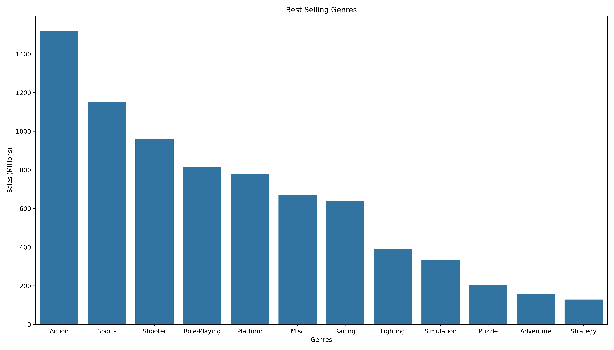
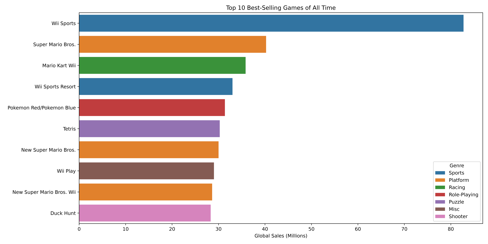
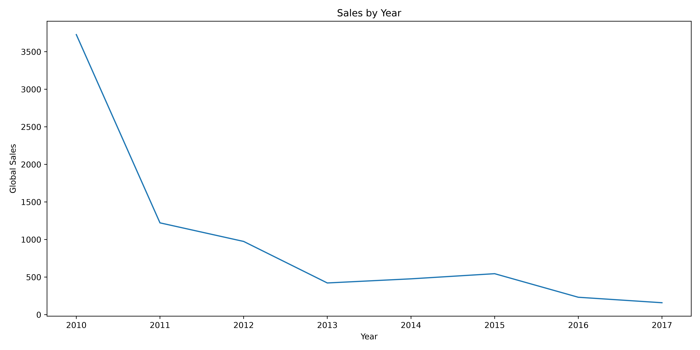
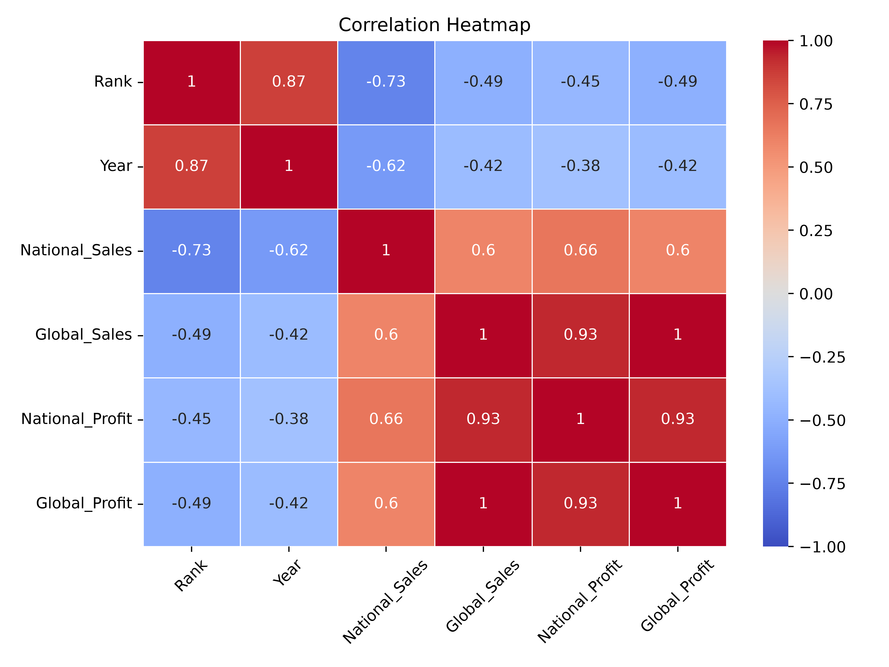

# Video Game Sales Analysis

Exploratory data analysis of historical video game sales data, exploring trends across genres, publishers, platforms, and regions.

## 📊 Dataset

- **File:** `video_games_sales.csv`
- **Size:** 5,909 rows × 15 columns (5,851 rows after cleaning)
- **Columns:** Rank, Name, Platform, Year, Month, Genre, Publisher, Country, City, State, Region, NA_Sales, Global_Sales, NA_Profit, Global_Profit
- **Description:** Sales and profit figures (in millions) for video games, broken down by platform, genre, publisher, release date, and geographic region (United States and Australia).

## ❓ Questions Explored

- Which genres and platforms generate the highest sales?
- Who are the top-performing publishers, and how concentrated is the market around them?
- How have global sales trends changed over the years?
- How do sales differ across regions and countries?
- What is the relationship between global sales and global profit?
- Which games are the all-time best-sellers?

## 🛠️ Tools Used

- Python
- pandas, numpy — data cleaning and manipulation
- matplotlib, seaborn — visualization

## 🧹 Data Cleaning Summary

- Removed 16 duplicate rows (5,909 → 5,893 rows)
- Replaced the placeholder `"Unknown"` in `Publisher` with proper missing values, then dropped 42 affected rows (0.71% of the data — too small a share to justify imputation)
- Filled 27 missing values in `Region` (0.46% of the data) using **conditional probabilistic imputation**: since `Region` is strongly tied to `Country` (Australia is almost exclusively "West," while the U.S. spans four regions), each missing value was sampled from that country's own regional distribution rather than the overall dataset distribution
- Removed the `$` symbol from `NA_Sales` and converted it from string to `float64`
- Standardized inconsistent categorical values (`"USA"` → `"United States"`, `"October"`/`"November"` → `"Oct"`/`"Nov"`)
- Renamed `NA_Sales`/`NA_Profit` to `National_Sales`/`National_Profit` for clarity
- Handled extreme outliers in `National_Sales` using winsorization (capped at the 95th percentile)

## 📈 Key Insights

- **Action is the best-selling genre** by a wide margin (~1,521M in global sales), outperforming Sports (2nd place) by roughly 370M.
- **Wii Sports is the best-selling game of all time**, standing far above every other title, and Nintendo dominates the top-10 best-selling games list overall.
- **The United States drives the vast majority of sales** — 76.76% of national sales and 81.21% of global sales — with Australia contributing a much smaller share.
- **Global sales peaked around 2010** and have trended downward since, with a modest, temporary recovery around 2015.
- **Global Sales and Global Profit are almost perfectly correlated (1.00)**, and National_Profit also correlates strongly with Global Sales (0.93), confirming that top-performing games succeed across markets consistently.
- **Region and Country are interdependent**: sales in the "West" region come from both the U.S. and Australia, while "East" and "Central" are almost exclusively U.S. markets.

## 🖼️ Sample Visualizations
### Best Selling Genres

### Top 10 Best-Selling Games

### Sales by Year

### Correlation Heatmap


## 🚀 How to Run

```bash
git clone https://github.com/MP-Razgardani/video-game-sales-analysis.git
cd video-game-sales-analysis
pip install -r requirements.txt
jupyter notebook notebooks/video_game_sales_eda.ipynb
```

## 📁 Project Structure

```
video-game-sales-analysis/
├── data/
│   └── video_games_sales.csv
└── images/
    ├── best_selling_genres.png
    ├── correlation_heatmap.png
    ├── sales_by_year.png
    └── top_10_games.png
├── notebooks/
│   └── video_game_sales_eda.ipynb
├── README.md
├── requirements.txt

```

## 👤 Author

Mohammad Parsa Razgardani — github.com/MP-Razgardani
